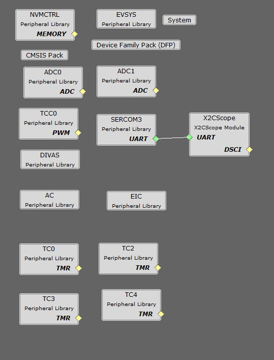
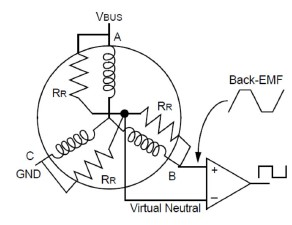
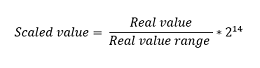
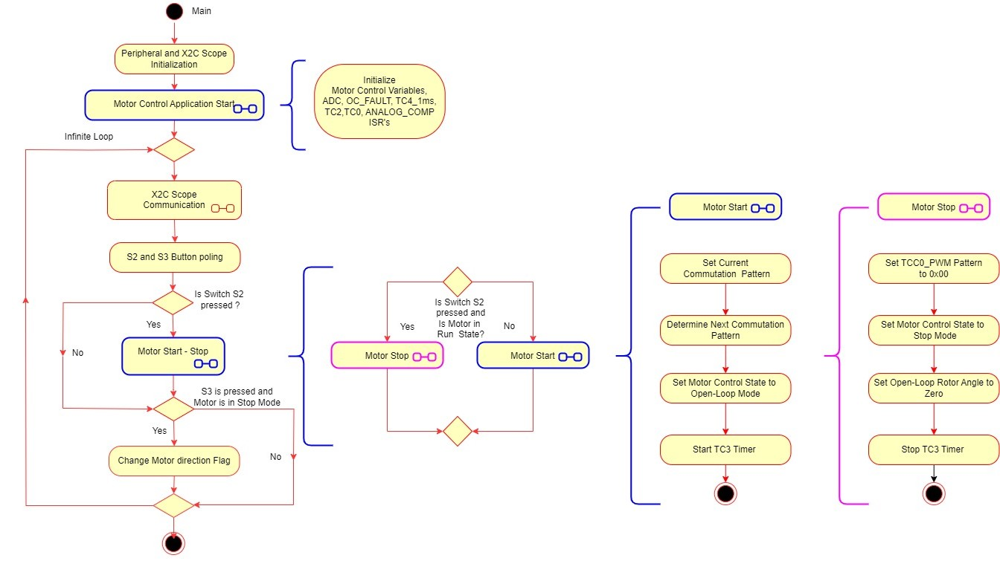
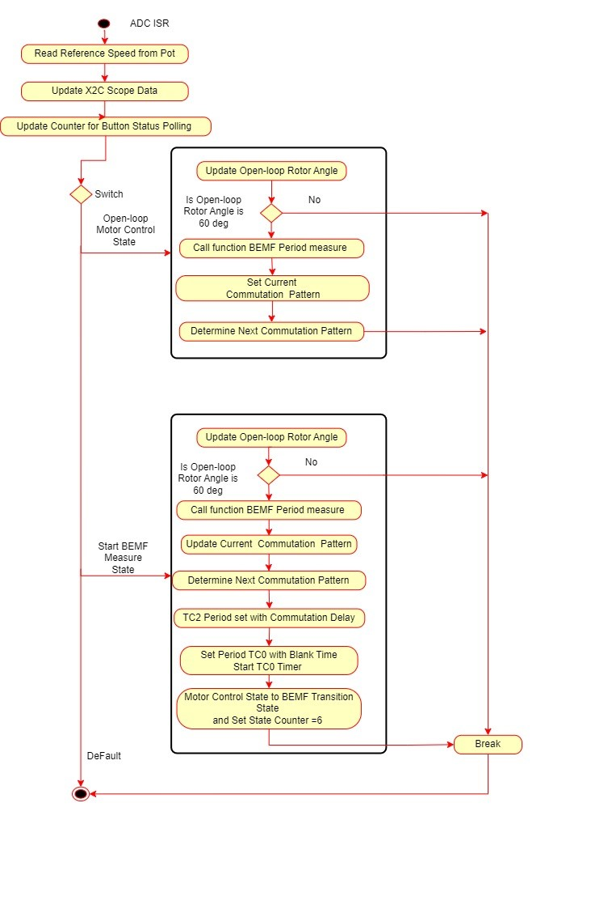
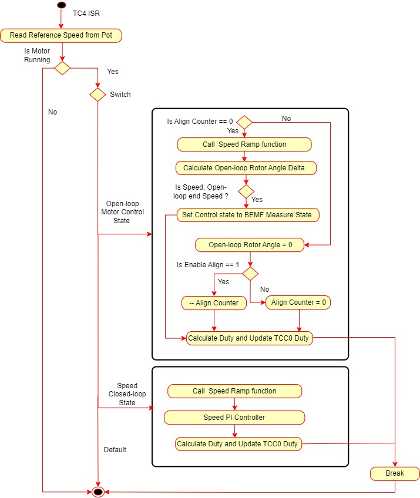
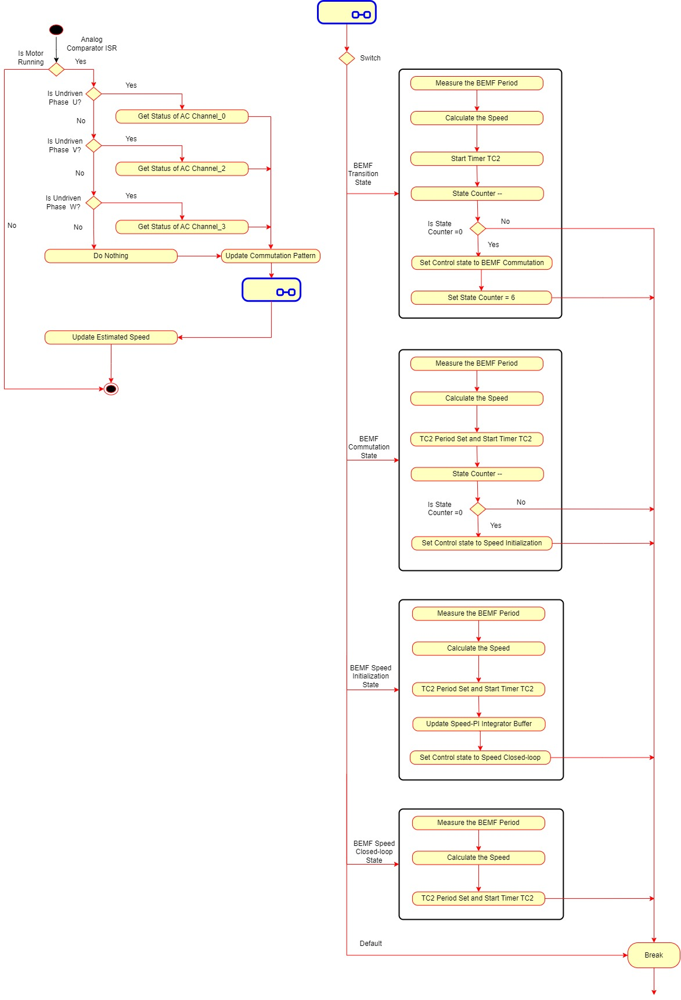
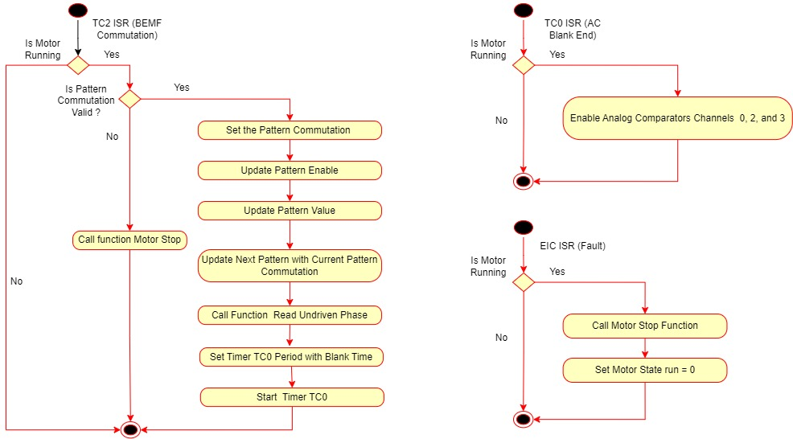
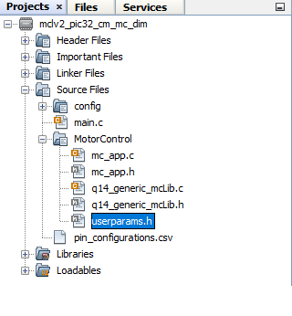

# BLDC Sensorless Block Commutation using BEMF ZCD 

Brushless Direct Current electric motor, or BLDC motors for short, are electronically commutated motors powered by a DC electric source via an external motor controller. This document serves as a guidance to build, configure and run Block Commutation algorithm for BLDC motors on Microchip's 32-bit PIC32CM MC00  microcontroller devices.

## Description

Brushless Direct Current (BLDC ) motor is controlled using Block Commutation of Sensorless BEMF Zero Crossing Detection (ZCD). Motor start/stop operation is controlled by the switch and motor speed can be changed by the on-board potentiometer. Waveforms and variables can be monitored runtime using X2CScope. 

Key features enabled in this project are:

- BLDC Commutaton

## MHC Project Configurations

- **ADC0-ADC1 Peripheral**: 

  - ADC0 and ADC1 are setup to operate in Master - Slave mode with ADC0 acting as a Master
  - Both ADCs convert single ended inputs. DC link current is sampled and converted by ADC0 which can be used for current control. Potentiometer is sampled and converted by ADC1
  - Both ADCs are hardware triggered simultaneously by an event generated from TCC0 at the end of each PWM cycle
  - Conversion Ready interrupt is generated by ADC0. Since both ADCs are triggered simultaneously and have same resolution and sampling time, both ADCs complete conversion at the same time

- **TCC0 Peripheral**: 
  - Configured to generate 3 pairs of single PWM signals at frequency of 20 kHz in Edge Aligned Mode
  - Event output is enabled which is generated for counter overflow
  - Non-recoverable Fault is enabled on EV0. When an event is detected on EV0, all PWM channels are held low. 

- **TC0,TC2-TC4 Peripherals**: 
  - #### TC0 peripheral
     - The TC0 peripheral is used as a timer. 
     - The timer period is set to 0.003 ms. 
     - The one-shot mode and the interrupt  is enabled for the timer. 
     - The input clock frequency for the TC0 peripheral is 48 MHz.
     - TC0 ISR is used to generate the Blank end timing after the commutation. It sets the blanking time to start the zero-crossing detection once the new sector is switched.   
  - #### TC2 peripheral 
     - The TC2 peripheral is used as a timer. 
     - The timer period is set to 1 ms. 
     - The one-shot mode and the interrupt  is enabled for the timer. 
     - The input clock frequency for the TC2 peripheral is 8 MHz.
     - TC2 ISR is used for Block commutation, .
  - #### TC3 peripheral 
     - The TC3 peripheral is used as a timer. 
     - The timer period is set to 131.072006 ms. 
     - The input clock frequency for the TC3 peripheral is 48 MHz.
     - TC3 peripheral is use to measure the period between the two zero crossing points. 
  - #### TC4 peripheral  
    - The TC4 peripheral is used as an internal timer counter. 
    - The timer interval is set to 1 ms.
    - The input clock frequency for the TC4 peripheral is 8 MHz. 
    - The 1 ms timer interrupt handler is used to excute the rotor alignment mode,  open-loop start-up mode, and closed-loop BMEF ZCD mode.

- **EIC**:
  - External Interrupt Controller detects hardware over-current fault input and generates a non-recoverable fault event for TCC0, thereby shutting down the PWM in the event of an over-current fault

- **EVSYS**:
  - Event System acts as a traffic cop between event generator and event users
  - Event generated by the TCC0 when the counter overflows, is used by the ADC0 as a hardware trigger source via Event System
  - Event generated by the EIC upon over-current fault, is used by the TCC0 as a non-recoverable fault event via Event System

- #### **Analog Comparator(AC):**
  - The analog comparators allow comparison of analog voltages against a known reference voltage to determine their relative levels.
  - analog comparators for zero-crossing detection,  one terminal of the comparator input is configured   to monitor the relevant analog signal of U V W phases, and the other terminal is configured to virtual ground. 

- **SERCOM3 Peripheral**: 
  - SERCOM3 is configured in USART mode and is set to operate at 115200 bps.
  - This USART channel is used by the X2CScope plugin to plot or watch global variables in run-time. Refer to X2C Scope Plugin section for more details on how to install and use the X2CScope.

## Control Algorithm
Brushless Direct Current electric motors, or BLDC motors for short, are electronically commutated motors powered by a DC electric source via an external motor controller. The electronic commutation to rotate the motor is achieved by a three phase inverter. The commutation technique are broadly classified as block Commutation and Sinusoidal commutation.
The block commutation has reduced system complexity as compared to the sinusoidal commutation. Hence, the block commutation technique is quite popular for the low cost applications where control precision, reduced efficiency, and higher acoustic noise are permitted.

The key of the sensorless control method is to determine the appropriate moment when the motor winding should be commutated. This moment is determined by the rotor position. With sensored control, the rotor position is well known. However, in sensorless control, rotor position must be determined by the detection of the BEMF zero-crossing.

The method for energizing the motor windings in the sensorless method  is the six-step commutation. Each step, or sector, is equivalent to 60 electrical degrees. Six sectors make up 360 degrees, or one electrical revolution. For every sector, two windings are energized and one is not energized. The fact that one of the windings is not energized during each sector is an important characteristic for the use of  sensorless control.

Pulse-width modulation is used to apply a variable voltage to the motor windings. Changing the PWM duty-cycle of the transistors (T1 to T6) signals, changes the amount of current flowing through the windings of the motor.

Below diagram shows the high side modulated PWM:

## Zero-crossing detection
The BEMF zero-crossing signal is used to provide a position feedback to estimate the right commutation instant. In this implementation, the method employed to measure the zero-cross point is by using a comparator with a variable reference consisting of the sum of all the phase voltages.

 

## Software Design

This section describes the software design of BLDC block commutation application. The first part of this section, numerical scaling for fixed-point implementation is briefly described. The later section, the software implementation of the example project is described.

### Scaling:
The example project uses Q14 format to represent the real-time physical quantities as follows:

The real value range of voltage, current and speed is chosen as independent base quantities for deriving the range of other physical quantities. The independent base quantities are determined by considering the electrical constraints of the MCLV2 development board and the motor used.

### Software Implementation

### Software Configuration
The motor specific parameters, board specific parameters and application parameter macros have to be updated in the software for optimal control of the BLDC motor. The following section briefly describes motor and application specific parameters used in the project. These parameter macros can be found in userparams.h header file which can be found under logical path: Header Files > config > <config_name> >userparams.h in MPLABX IDE.

#### Setting motor control PWM frequency and dead-time:
PWM frequency is set by configuring the timer period of the TCC0 in terms of TCC0 clock counts. This frequency needs to be communicated to other sections in the algorithm by defining the "Period Value" (set in MPLAB Harmony Configurator) + 1 as a macro in userparams.h.
For example, in order to achieve a PWM frequency of 20 KHz in edge aligned mode with peripheral clock frequency of 48MHz, the period value defined in MHC is 2399. Therefore, the macro defined in userparams.h should be "period value" + 1 = 2400. 

| Macro | Description |
|------|----------------|
| PWM_PERIOD | PWM Timer period value = "Period value" defined in MHC + 1 |
|

#### Setting motor specific parameters:
Set the following motor specific parameters in the userparams.h file.

| Macro | Description | Unit |
|-------|----------------|---------|
| MAX_MOTOR_POLE_PAIRS | Number of Pole Pairs | - |
| MAX_MOTOR_SPEED | Rated speed of the motor | RPM |
|

#### Setting motor control specific parameters:
Set the following motor specific parameters in the userparams.h file.

| Macro | Description | Unit |
|-------|----------------|---------|
|OPENLOOP_START_SPEED_RPM | Minimum speed require to iniitate the motor start|RPM
|OPENLOOP_END_SPEED_RPM| Maximum Speed at which the BEMF is sufficient enough to detect by Analog Comparators| RPM
|MOTOR_RAMPUP_SPEED_PER_MS| Rate at which motor accelerates |  milli Sec|
|OPENLOOP_END_PWM_DUTY| Maximum duty that can be applied in Open-loop| - |
|OPENLOOP_PWM_OFFSET| Minimum duty that can be applied in Open-loop| -|
|OPENLOOP_ALIGN_PERIOD| Time required to align the rotor to known position|  Seconds
|

#### Setting virtual hall pattern and commutation pattern:
Below array gives the virtual hall pattern and commutation pattern relation for long hurst and small hurst motors.

Hall_Array[16] = { 0,   5,  3,  1,  6, 4,  2,  0,  0,  3,   6,   2,  5,  1,  4,  0 }

Commutation_Array[16] = 
{
    0,
    0x4075, 
    0x2076, 
    0x4076,
    0x1073, 
    0x1075, 
    0x2073,
    0,
    0,
    0x2073,
    0x1075,
    0x1073,
    0x4076,
    0x2076,
    0x4075,
    0 
    }

  
Hall array and commutation patterns are defined in the mc_app.c file.
HALL_ARRAY[16] array contains the hall pattern for both the directions - first 8 entries are for clockwise direction and next 8 entries are for anti-clockwise direction.

COMMUTATION_ARRAY[16] array contains commutation pattern corresponding to the hall pattern - first 8 entries are for clockwise direction and next 8 entries are for anti-clockwise direction.

e.g The entry in the commutation array for V+W- is 0x4075.
This is given in terms of the pattern enable register TCC_PATT.

Pattern value configuration for V+W- is 0x40. This means low side switch of Phase W is continuously ON. 

| X  | W- | V- | U- |  X | W+ | V+ | U+ |
|----|----|----|----|----|----|----|----|
| 0  | 1  | 0  | 0  | 0  | 0  | 0  | 0  |
|    |    |    |    |    |    |    |    |

Phase V high side switch where PWM will be applied as per speed command.

| X  | W- | V- | U- |  X | W+ | V+ | U+ |
|----|----|----|----|----|----|----|----|
| 0  | 1  | 1  | 1  | 0  | 1  | 0  | 1  |
|    |    |    |    |    |    |    |    |

## Development Kits

### MCLV with PIC32CM MC00 Family Motor Control DIM
#### Downloading and building the application

To clone or download this application from Github, go to the [main page of this repository](https://github.com/Microchip-MPLAB-Harmony/mc_apps_pic32cm_mc) and then click **Clone** button to clone this repository or download as zip file.
This content can also be downloaded using content manager by following these [instructions](https://github.com/Microchip-MPLAB-Harmony/contentmanager/wiki).

Path of the application within the repository is **apps/bldc_bc_sensorless_pic32_cm_mc** .

To build the application, refer to the following table and open the project using its IDE.

| Project Name            | Description                                    | Demo User Guide |
| ----------------------- | ---------------------------------------------- |--------------------|
| mclv_pic32cm_mc_dim.X | MPLABX project for MCLV board with PIC32 CM MC00 |[MCLV with PIC32CM MC00 PIM](../docs/mclv_pic32cm_mc_dim_bc_sensorless.md)|
||||

