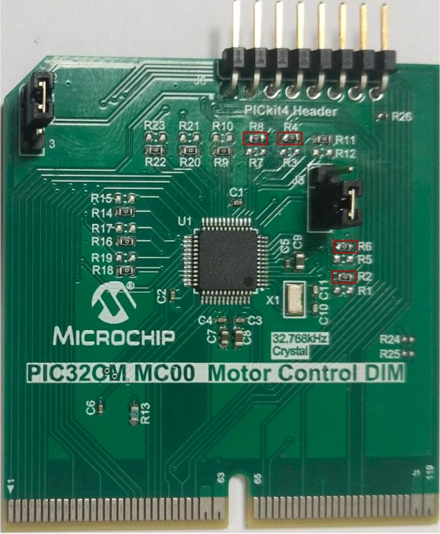
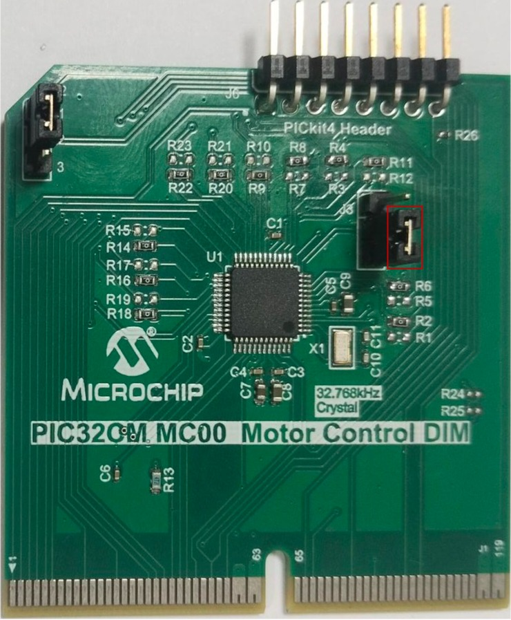
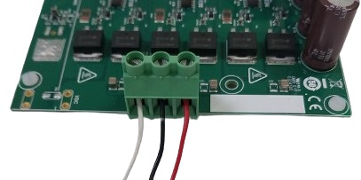
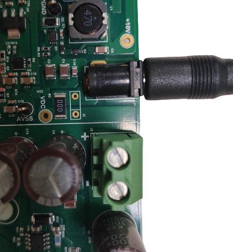
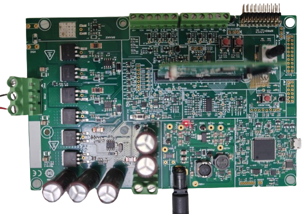

# MCLV 48V 300W Development Board
## Setting up the hardware

Following hardware is used for the demonstration.
- [MCLV 48V 300W Development Board](https://www.microchip.com/en-us/development-tool/ev18h47a)
- [PIC32CM MC00 DIM](https://www.microchip.com/en-us/development-tool/EV24X01A)
- [Hurst AC300022](https://www.microchip.com/DevelopmentTools/ProductDetails/PartNo/AC300022)

### Setting up [MCLV 48V 300W Development Board](https://www.microchip.com/en-us/development-tool/ev18h47a)
- Remove resistors **R1**, **R3**, **R5**, and **R7** of PIC32CM MC00 Motor Control Dual In-Line Module ( DIM ) as shown below:
  

    
  

- Populate resistors **R2**, **R4**, **R6**, and **R8** of PIC32CM MC00 Motor Control DIM as shown below:
  

    
  

- Connect the jumper J3 of PIC32CM MC00 DIM to 2-3 position as shown below.
  

    
  

- Insert the PIC32CM MC00 Motor Control DIM on J8 interface header.

- Motor Connections: Connect the 3 Phase connections of the motor on the J4 header.

  

    
  

- Power the board with a 24V DC supply using J1 or J3(+,-) header. For additional safety, it is recommended to use a current limited power supply while testing this software demonstration on a non-default hardware and motor.

  

    
  

- Complete Setup

  

    
  

## Running the Application

1. Build and Program the application using its IDE
2. Press switch SW1 to start the motor
3. Vary potentiometer to change the speed of the motor
4. Press switch SW1 to stop the motor
5. Press switch SW2 to change the direction of the motor
6. Press switch SW1 again to start the motor
7. Monitor graphs on X2C Scope

Refer to the following tables for switch and LED details:

| Switch | Description |
|------|----------------|
| Switch SW1 | To start or stop the motor |
| Switch SW2 | To change the direction of rotation.  Direction toggle command is accepted only when motor is stationary. |
||

| LED D2 Status | Description |
|------|----------------|
| OFF  | Motor spin direction is "positive"  |
| ON  | Motor spin direction is "negative"   |
||

| LED D1 Status | Description |
|------|----------------|
| OFF  | No fault  |
| ON   | Fault is detected  |
||

